# 📚 Bookia Store App


**Bookia Store** is a premium mobile application designed for book enthusiasts. It provides a seamless and aesthetically pleasing experience for browsing, searching, and purchasing books. Built with a focus on modern design principles, performance, and multi-language support.

---

## 🚀 Features

### 🔐 Authentication & Security
- **Smart Onboarding**: Beautiful welcome and splash screens.
- **Secure Login/Register**: Dedicated screens for user authentication.
- **Password Recovery**: Integrated "Forgot Password" flow with OTP (One-Time Password) verification.
- **Localization**: Full support for English and Arabic in all auth flows.

### 🏠 Home & Discovery
- **Dynamic Banners**: Interactive slider for featured books and promotions.
- **Smart Catalog**: Browse books with quick access to details.
- **Detailed View**: Comprehensive book information including description and pricing.

### 🛒 Shopping Experience
- **Wishlist Management**: Keep track of books you love.
- **Cart System**: Seamlessly add items to your cart and manage quantities.
- **Order Tracking**: (In Progress) View your previous orders and their status.

### ⚙️ User Experience
- **RTL Support**: Native Right-to-Left support for Arabic users.
- **Responsive Design**: Optimized for different screen sizes using `flutter_screenutil`.
- **Theming**: Premium typography using the `DM Serif` font family.

---

## 🛠️ Tech Stack & Architecture

### Core Technologies
- **Framework**: [Flutter](https://flutter.dev/) (latest stable)
- **State Management**: [flutter_bloc](https://pub.dev/packages/flutter_bloc) (Cubit for lightweight logic)
- **Networking**: [Dio](https://pub.dev/packages/dio) with custom interceptors and logging.
- **Local Storage**: [shared_preferences](https://pub.dev/packages/shared_preferences) for session management.
- **Localization**: [easy_localization](https://pub.dev/packages/easy_localization) for multi-language support.

### Architecture: Feature-First (Clean Architecture)
The project follows a **Feature-First** structure to ensure scalability and maintainability:
- `core/`: Global helpers, navigation, and shared constants.
- `features/`: Modularized feature folders (Auth, Home, Cart, etc.) each containing:
    - `data/`: Repositories and models.
    - `cubit/`: State management logic.
    - `ui/`: Responsive screens and specialized widgets.

---

## 📱 Visual Showcase

### 🔐 Authentication & Onboarding
| Welcome (EN) | Welcome (AR) | Login (EN) | Login (AR) |
| :---: | :---: | :---: | :---: |
| 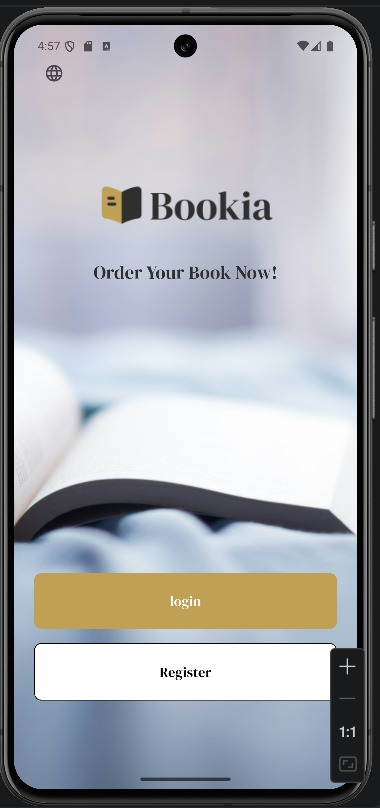 |  | 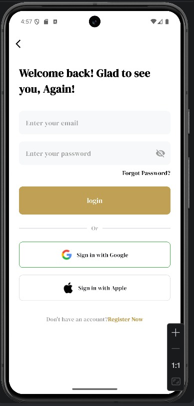 | 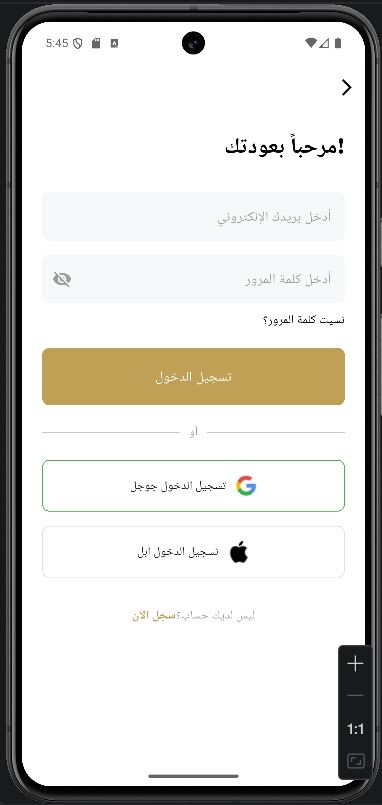 |

| Register (EN) | Register (AR) | Forgot Password | OTP Verification |
| :---: | :---: | :---: | :---: |
| 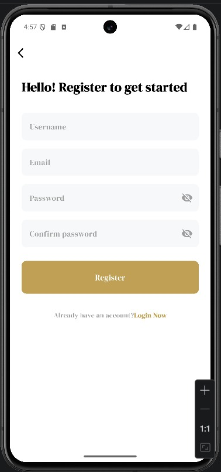 | 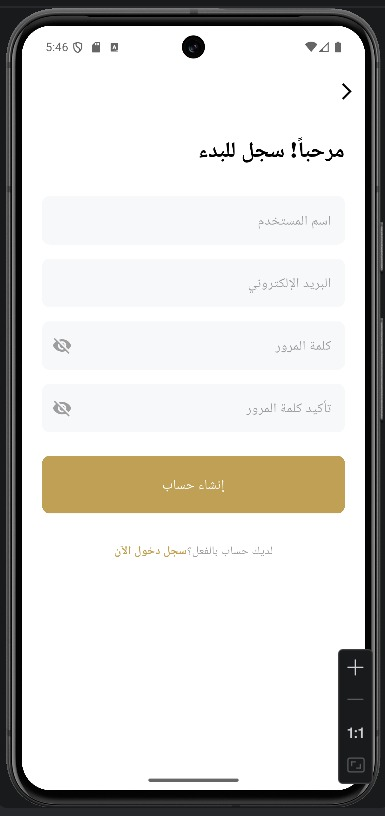 | 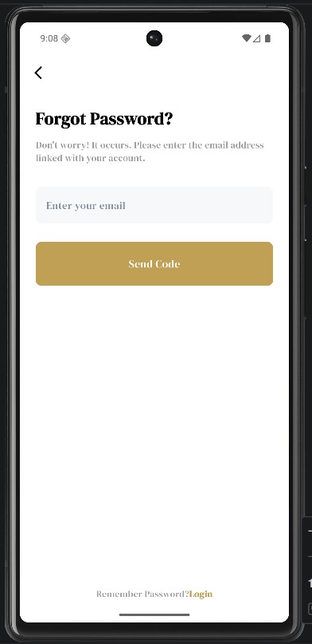 | 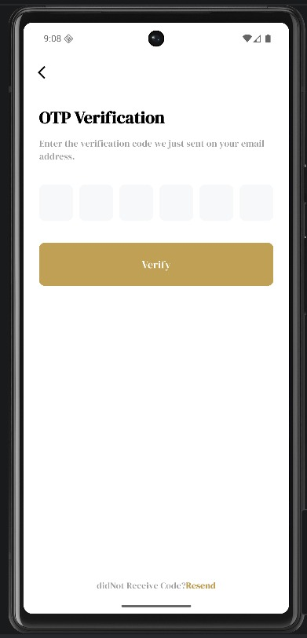 |

### 🏠 Home & Shopping
| Home (EN) | Home (AR) | Wishlist (EN) | Wishlist (AR) |
| :---: | :---: | :---: | :---:|
| 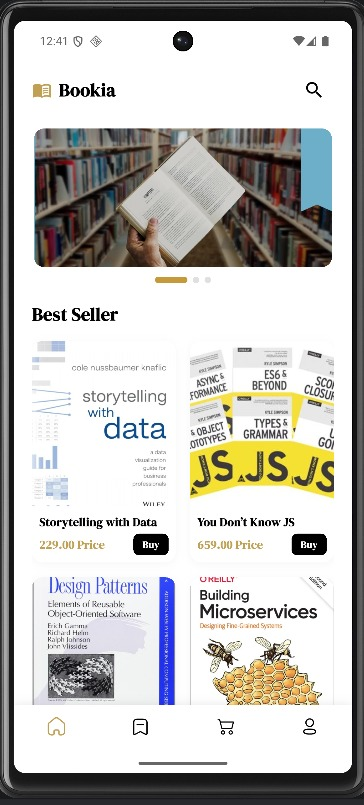 | 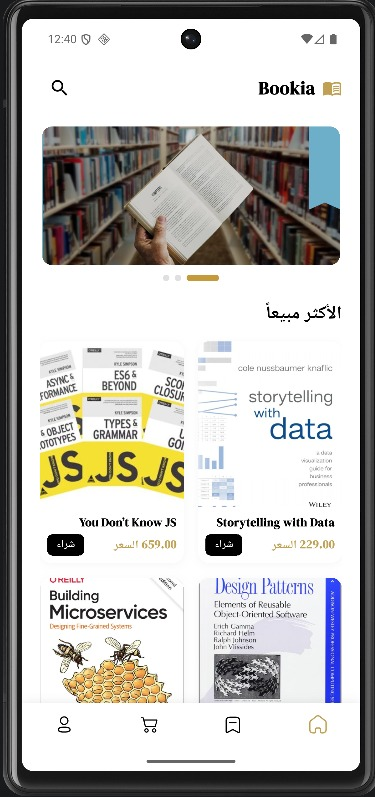 | 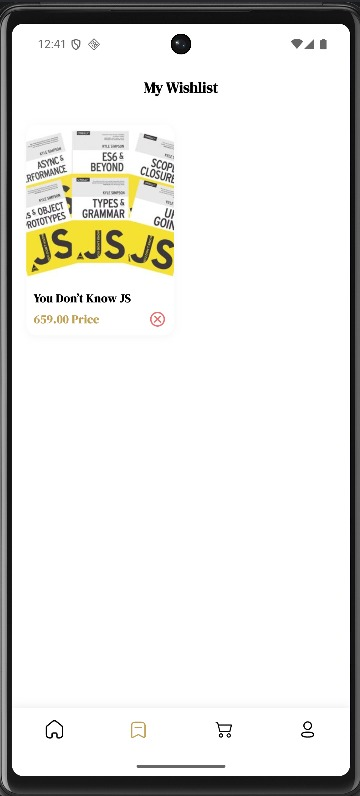 | 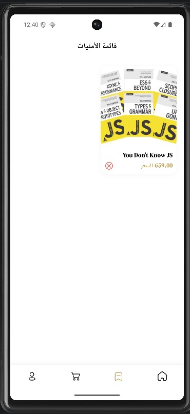 |

### 🛒 Cart & Checkout
| My Cart (EN) | My Cart (AR) | Place Order (EN) | Place Order (AR) |
| :---: | :---: | :---: | :---: |
| 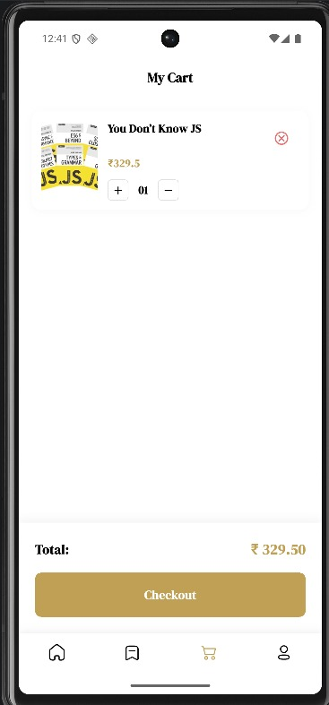 | 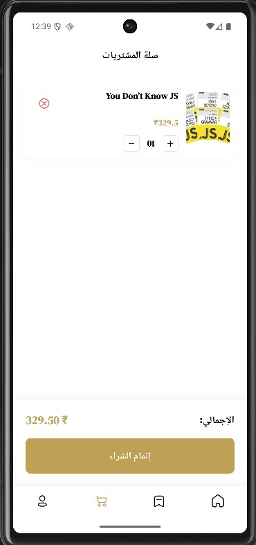 | 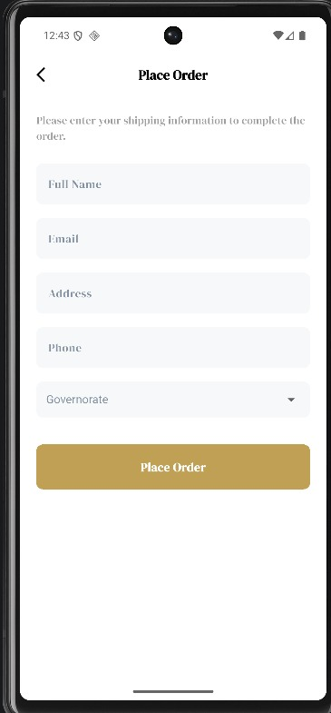 | 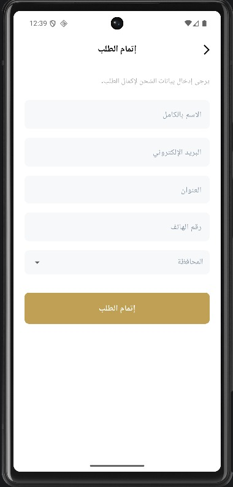 |

### 👤 Profile & Settings
| Profile (EN) | Profile (AR) |
| :---: | :---: |
| 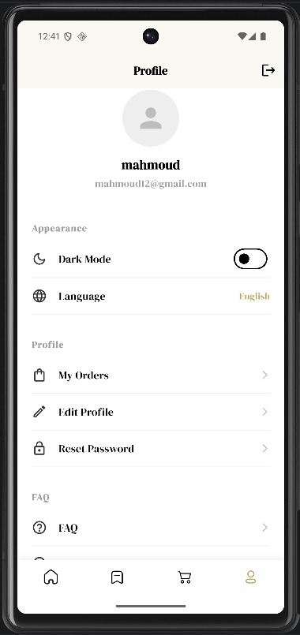 |  |


## 🏁 Getting Started

### Prerequisites
- Flutter SDK (>= 3.10.0)
- Android Studio / VS Code
- Git

### Installation
1. Clone the repository:
   ```bash
   git clone https://github.com/mahmoudashraf009/bookia_store.git
   ```
2. Install dependencies:
   ```bash
   flutter pub get
   ```
3. Generate localized keys (if added new translations):
   ```bash
   flutter pub run easy_localization:generate -S assets/translations -O lib/gen/translations -o locale_keys.g.dart -f keys
   ```
4. Run the app:
   ```bash
   flutter run
   ```

---

## 📂 Project Structure

```text
lib/
├── core/               # Global configurations & routing
├── features/           # App modules (Auth, Home, Cart, Profile, etc.)
│   ├── auth/           # Login, Register, Forgot Password
│   ├── home/           # Sliders, Book List
│   ├── cart/           # Shopping Cart logic
│   └── ...
├── gen/                # Generated assets & translations
├── book_store_app.dart # App level widget & theme
└── main.dart           # Entry point
```

---

## 👨‍💻 Author
**Mahmoud Ashraf**  
*Flutter Developer*

---
