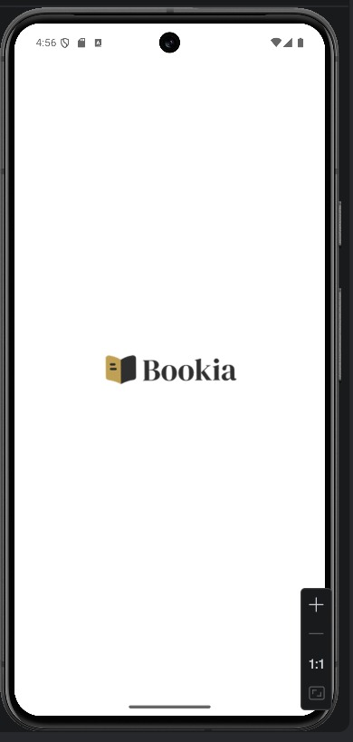
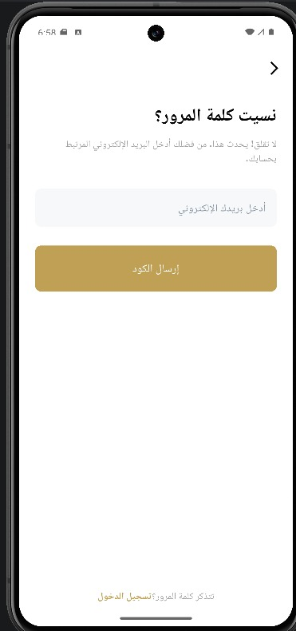
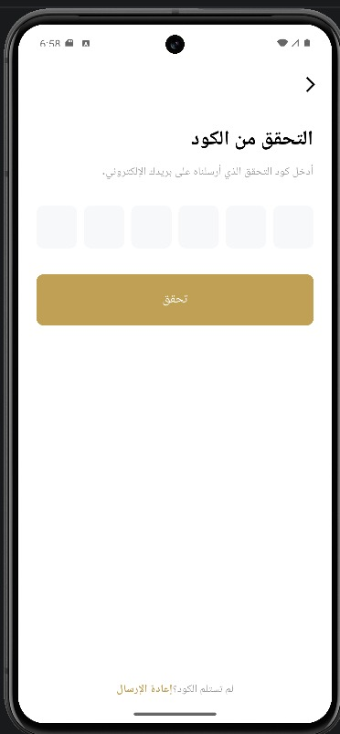

# 📚 Bookia App

Bookia is a mobile application designed to help users browse and order books easily.  
The app focuses on providing a simple and clean user experience with support for multiple languages.

---

## ✨ Features
- Clean and modern UI
- User authentication (Login & Register)
- Multi-language support (English & Arabic)
- Localized authentication screens (Welcome, Login, and Register)
- Responsive layout

---

## 📱 Screens

### Splash Screen

This is the splash screen that appears when the application starts.  
It displays the **Bookia logo** while the app loads before navigating to the main screen.

---

### Welcome Screen (Arabic)

This screen is the Arabic version of the welcome page.  
It allows users to choose between **logging in** or **creating a new account**, demonstrating the app's **Arabic localization support**.

---

### Welcome Screen (English)

This is the English version of the welcome screen.  
Users can select **Login** or **Register**, and it also includes a **language switch icon** to change the app language.

---

### Login Screen (English)

The login screen allows users to sign in using their **email and password**.  
It also supports **Google sign-in and Apple sign-in**, and provides an option to reset the password if forgotten.

---

### Login Screen (Arabic)
)

This is the Arabic localized version of the login screen, providing the same authentication functionality for Arabic-speaking users.

---

### Register Screen (English)

The registration screen allows new users to create an account by entering their **username, email, password, and password confirmation**.

---

### Register Screen (Arabic)

This is the Arabic localized version of the registration screen, allowing users to create an account with full Arabic interface support.

---
🔐 Forgot Password Screen

This screen allows users to recover access to their accounts if they forget their password.
Users need to enter the email address associated with their account, and the system will send a verification code to their email to continue the password reset process

---
🔢 OTP Verification Screen

After requesting a password reset, users are directed to the OTP verification screen.
Here they enter the 6-digit verification code sent to their email.
Once verified, the user can proceed to reset their password securely

---

## 🛠️ Built With
- Flutter
- Dart
- Localization

---

## 👨‍💻 Author
Mahmoud Ashraf